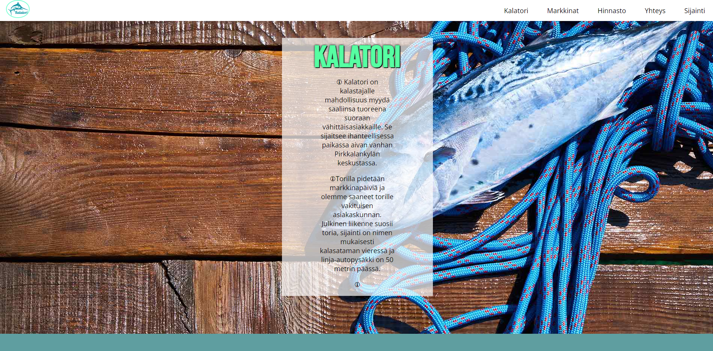

# Kalatorin nettisivut
## Sähköinen asiointipalvelu -kurssin harjoitustyö

|Projekti|Nettisivut|
|--------|:--------|
|Tekijä|Rasmus Kuurila|
|Tekniikat|HTML & CSS|

## Komponentit
- nav
  - Responsiivinen navigaatio
  - Toteutettu ankkurilinkeillä
  - Kalatori logo
- header
  - Hero-kuva
  - Pääotsikko
  - Kuvausteksti
- section (markkinat)
  - Markkinoiden ajankohdat
  - Kuvituskuvia
- section (hinnasto)
  - Torikarttakuva
  - Hinnastotaulukko
- section (yhteystiedot)
  - Myyntipöydän varauslomake
- section (sijainti)
  - Upotettu Google Maps -kartta
- footer
  - Yhteystiedot
  - Somelinkit

## Julkaisut
### Julkaisu 1
  - nav
  - header
  - sectionit
  - footer

  ## Kuvakaappaukset
  